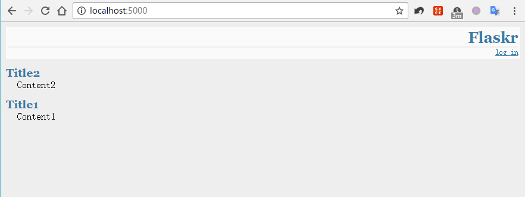
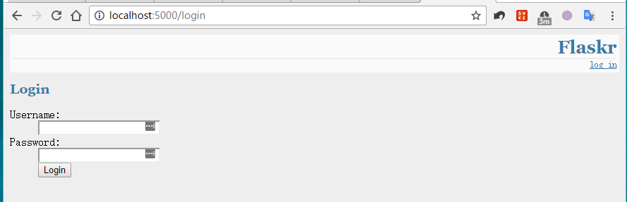
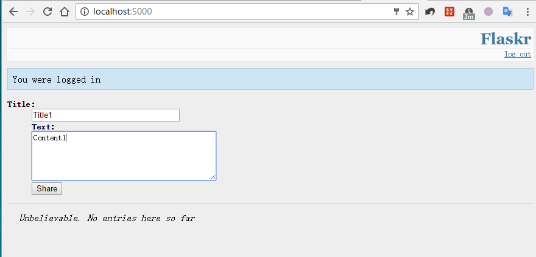
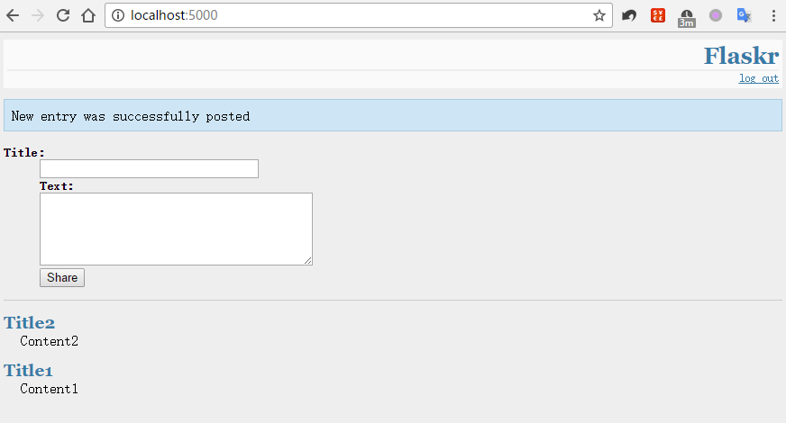
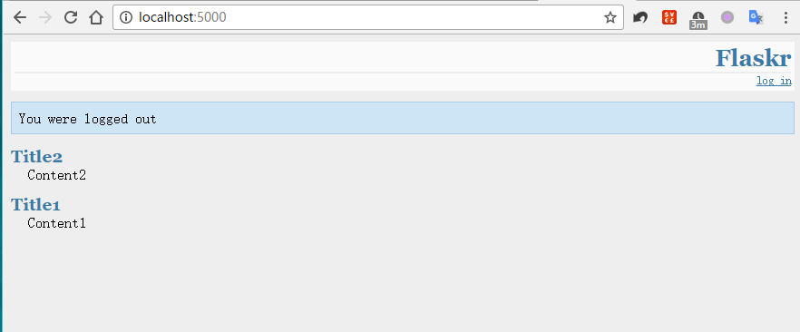

# simple_blog
使用flask搭建的一个数据库驱动的极简blog

---
## 一些使用示例

### 主页（blog按照时间由近到远排列）



###  登录（包含登录成功/失败的提示消息）



### 写blog





### 退出登录



---

# 如何使用

1. 下载

2. 进入根目录（simple_blog目录）

3. 在python交互环境中执行以下代码（初始化数据库）

   ```python
   from flaskr import init_db
   init_db()
   ```

4. 执行本程序

   ```powershell
   python flaskr.py
   ```

### 须知

* 默认用户名: admin
* 默认密码: default

